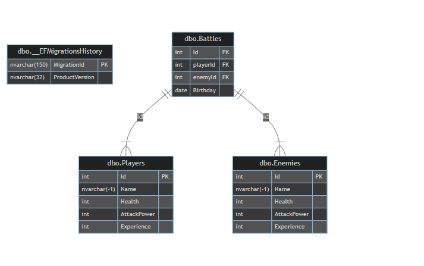

# Text-Based BattleLog
## Overview
- Text-Based Battler is an ASP.NET Core application that allows users to engage in creating a log for battles between a player and various enemies. 
- The application features a RESTful API for managing players, enemies, and battle logs, with data persistence to a SQL Server database.

## Requirements
- README that describes the application and its functionalities
- ERD of your DB
- The application should be ASP.NET Core application
- The application should build and run
- The application should have unit tests and at least 20% coverage (at least 5 unit tests that tests 5 different methods/functionality of your code)
- The application should communicate via HTTP(s) (Must have POST, GET, DELETE)
- The application should be RESTful API
- The application should persist data to a SQL Server DB
- The application should communicate to DB via EF Core (Entity Framework Core)

## Tech Stack
- ASP.NET Core
- Entity Framework Core
- SQL Server
- Swagger

## User Stories
### Player Management
- As a user, I want to create a player so that I can use them in battles.
- As a user, I want to retrieve a list of all players so that I can view their stats.
- As a user, I want to update a player's information so that I can change their stats or name.
- As a user, I want to delete a player by ID so that I can manage my roster.
### Enemy Management
- As a user, I want to create an enemy so that I can add new challenges to the game.
- As a user, I want to retrieve a list of all enemies so that I can view their stats.
- As a user, I want to update an enemy's information so that I can change their stats or name.
- As a user, I want to delete an enemy by ID so that I can manage the available opponents.
### Battle Logging
- As a user, I want to create a battle between a player and an enemy so that I can set the outcome.
- As a user, I want to retrieve a log of all past battles so that I can review outcomes and history.

## Tables

## MVP Goals
- Player Management: Support GET, POST, PUT, and DELETE operations for players.
- Enemy Management: Support GET, POST, PUT, and DELETE operations for enemies.
- Battle Simulation:  Support GET, POST, PUT, and DELETE operations for a battle log

## Stretch Goals
- Engage in battles between a player and an enemy via some front-end or console.